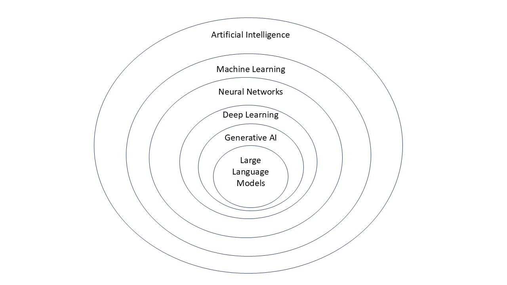

# A taxonomy of Artificial intelligence including applied projects
## By Freek van den Berg

Artificial intelligence (AI) is a multidisciplinary field concerned with the design and development of computational systems capable of performing tasks that traditionally require human intelligence, including learning, reasoning, perception, and decision-making. Rooted in computer science, mathematics, psychology, and engineering, AI seeks to formalize intelligent behavior and implement it in machines through algorithmic and statistical methods.

AI is not a monolithic discipline but rather an umbrella term encompassing a range of interconnected subfields. Machine learning provides data-driven approaches that enable systems to improve performance through experience, while neural networks offer a biologically inspired framework for modeling complex, non-linear relationships. Deep learning extends these models through hierarchical representations, enabling significant advances in domains such as computer vision, speech recognition, and natural language processing. More recent developments, including generative AI and large language models, further expand the scope of AI by enabling systems to generate coherent and contextually relevant content.

These subfields are highly interdependent and often overlap in both theory and application. A comprehensive understanding of AI therefore requires not only familiarity with its individual components but also an appreciation of the relationships between them and their collective role in advancing intelligent systems. 

The following Venn diagram conveniently illustrates how these subfields overlap. In the explanations that follow, each field is discussed without considering its direct subfield. For instance, the explanation of Artificial Intelligence considers the field of AI without considering Machine Learning, that is, traditional AI.

## Artificial Intelligence

Traditional [Artificial intelligence](artificial_intelligence/), often referred to as symbolic AI or classical AI, is an approach to AI that focuses on representing knowledge explicitly using symbols and applying logical rules to manipulate those symbols [1]. This paradigm dominated AI research from the 1950s through the 1980s and is grounded in the assumption that intelligent behavior can be achieved through formal reasoning over well-defined representations.

At the core of traditional AI is the idea that human knowledge can be encoded in a machine using structured formats such as rules, ontologies, and logic-based systems. These systems rely on techniques from fields such as formal logic, graph theory, and search algorithms to perform tasks like problem-solving, planning, and decision-making. A common example is a rule-based system, where knowledge is expressed as a set of “if–then” rules, and an inference engine applies these rules to derive conclusions.

Traditional AI systems are typically deterministic and interpretable, meaning their reasoning processes can be traced and understood step by step. This makes them particularly useful in domains where transparency and explainability are important, such as expert systems used in medical diagnosis or legal reasoning.

However, traditional AI has significant limitations. It struggles with uncertainty, ambiguity, and the complexity of real-world environments, as it requires exhaustive manual knowledge engineering and cannot easily adapt to new or unseen data. These challenges led to the rise of data-driven approaches, particularly machine learning, which can automatically learn patterns from data rather than relying solely on predefined rules.

See also: [Knowledge Representation](artificial_intelligence/knowledge_representation.md), [Natural Language Processing](artificial_intelligence/natural_language_processing.md), [Visual Perception](artificial_intelligence/visual_perception.md), [Intelligent Robot](artificial_intelligence/intelligent_robot.md) and [Automatic Reasoning](artificial_intelligence/automatic_reasoning.md).

## Machine Learning
[Machine learning](machine_learning/) is the study of programs that can improve their performance on a given task automatically [2].

There are several kinds of machine learning. Unsupervised learning analyzes a stream of data and finds patterns and makes predictions without any other guidance [3]. 

Supervised learning requires labeling the training data with the expected answers, and comes in two main varieties: (i) classification where the program must learn to predict what category the input belongs in [4]; and, (ii) regression where the program must deduce a numeric function based on numeric input [4].

In reinforcement learning, the agent is rewarded for good responses and punished for bad ones. The agent learns to choose responses that are classified as "good" [5]. 

Transfer learning is when the knowledge gained from one problem is applied to a new problem [6]. 

Deep learning (as discussed later) is a type of machine learning that runs inputs through biologically inspired artificial neural networks for all of these types of learning [10].

## Neural Networks
An artificial [neural network](neural_networks/) is based on a collection of nodes also known as artificial neurons, which loosely model the neurons in a biological brain. It is trained to recognise patterns; once trained, it can recognise those patterns in fresh data. There is an input, at least one hidden layer of nodes, and an output. Each node applies a function and once the weight crosses its specified threshold, the data is transmitted to the next layer. A network is typically called a deep neural network if it has at least 2 hidden layers [8].

Learning algorithms for neural networks use local search to choose the weights that will get the right output for each input during training. The most common training technique is the backpropagation algorithm [9]. Neural networks learn to model complex relationships between inputs and outputs and find patterns in data. In theory, a neural network can learn any function.

## Deep Learning
[Deep learning](deep_learning/) uses several layers of neurons between the network's inputs and outputs [10]. The multiple layers can progressively extract higher-level features from the raw input. For example, in image processing, lower layers may identify edges, while higher layers may identify the concepts relevant to a human such as digits, letters, or faces [11].

Deep learning has profoundly improved the performance of programs in many important subfields of AI, including computer vision, speech recognition, natural language processing, image classification [12]. The reason that deep learning performs so well in so many applications is not known as of 2021 [13]. The sudden success of deep learning in the 2010s did not occur because of some new discovery or theoretical breakthrough but because of two factors: (i) the incredible increase in computer power including the hundred-fold increase in speed by switching to GPUs; and, (ii) the availability of vast amounts of training data, especially the giant curated datasets used for benchmark testing.

## Generative AI
[Generative AI](generative_ai/) [14] is a branch of AI designed to create new content rather than simply analyze or classify existing data. It can produce text, images, music, video, and even code by learning patterns from vast amounts of training data. Instead of following fixed rules, generative AI models generate original outputs that resemble human-created content, making them powerful tools for creativity, automation, and problem-solving across many industries.

Generative AI that is not a large language model (LLM) refers to systems that create new content in forms other than text, such as images, audio, video, or structured data. These models include diffusion models (used in tools like Stable Diffusion) that turn noise into images, Generative Adversarial Networks like StyleGAN that generate realistic visuals through competition between two networks, and other approaches like VAEs that learn patterns in data to produce new variations. Unlike LLMs, which predict sequences of words, these systems generate patterns such as pixels, sound waves, or 3D structures, enabling applications in art, music, video creation, scientific design, and more.

## Large Language Models
[Large Language Models](large_language_models/) are a specialized type of generative AI focused on understanding and producing human language [15]. Trained on massive text datasets, they can generate coherent and context-aware responses, answer questions, summarize information, and assist with writing or coding tasks. By predicting the most likely sequence of words based on context, LLMs enable natural, conversational interactions between humans and machines.

## Bibilography
[1] Russell & Norvig (2021), pp. 1–4.

[2] Learning: Russell & Norvig (2021, chpt. 19–22), Poole, Mackworth & Goebel (1998, pp. 397–438), Luger & Stubblefield (2004, pp. 385–542), Nilsson (1998, chpt. 3.3, 10.3, 17.5, 20)

[3] Unsupervised learning: Russell & Norvig (2021, pp. 653) (definition), Russell & Norvig (2021, pp. 738–740) (cluster analysis), Russell & Norvig (2021, pp. 846–860) (word embedding)

[4] Supervised learning: Russell & Norvig (2021, §19.2) (Definition), Russell & Norvig (2021, Chpt. 19–20) (Techniques)

[5] Reinforcement learning: Russell & Norvig (2021, chpt. 22), Luger & Stubblefield (2004, pp. 442–449)

[6] Transfer learning: Russell & Norvig (2021, pp. 281), The Economist (2016)

[7] Artificial Intelligence (AI): What Is AI and How Does It Work?". Built In. Retrieved 30 October 2023

[8] Neural networks: Russell & Norvig (2021, chpt. 21), Domingos (2015, Chapter 4)

[9] Gradient calculation in computational graphs, backpropagation, automatic differentiation: Russell & Norvig (2021, sect. 21.2), Luger & Stubblefield (2004, pp. 467–474), Nilsson (1998, chpt. 3.3)

[10] Deep learning: Russell & Norvig (2021, chpt. 21), Goodfellow, Bengio & Courville (2016), Hinton et al. (2016), Schmidhuber (2015)

[11] Deng & Yu (2014), pp. 199–200

[12] Ciresan, Meier & Schmidhuber (2012)

[13] Russell & Norvig (2021), p. 750

[14] IBM. (2023). What is generative AI? IBM. https://www.ibm.com/topics/generative-ai

[15] Google Research. (2020). Language models are few-shot learners
